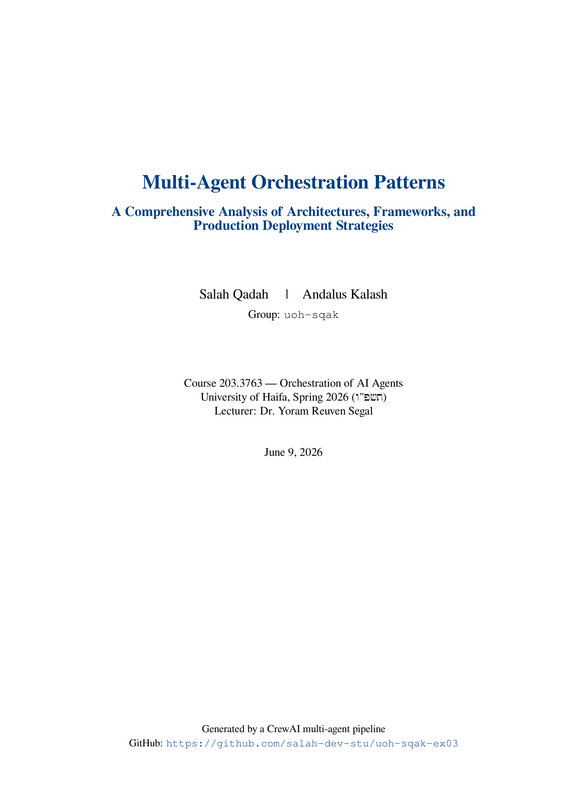
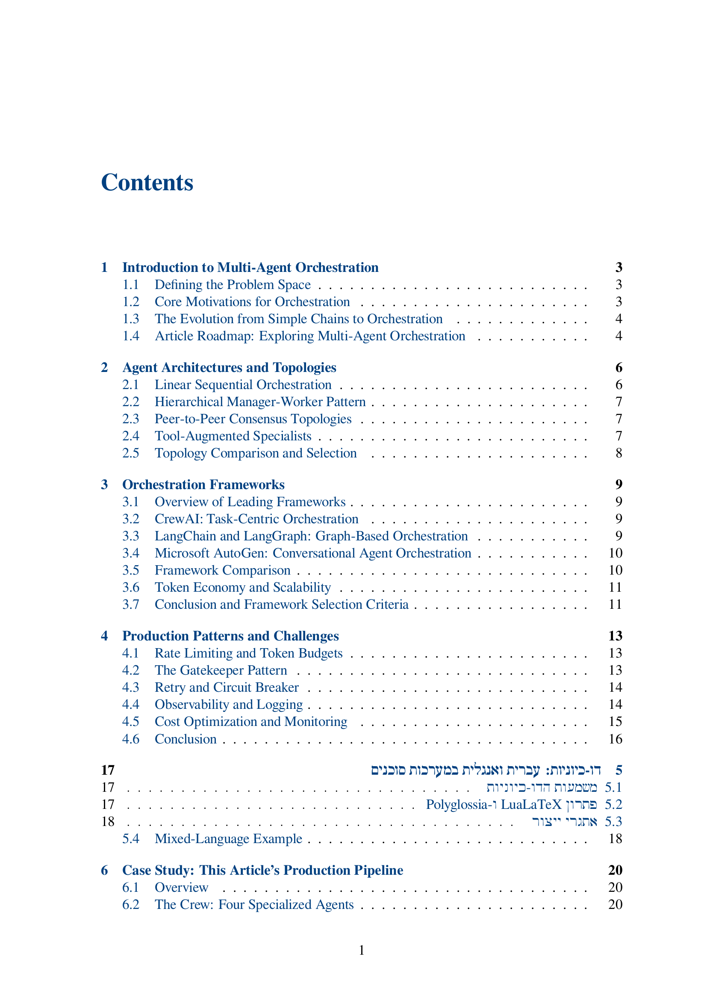
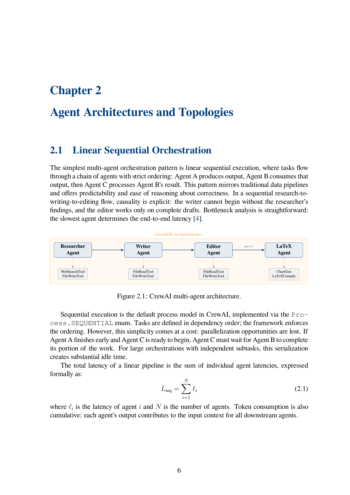
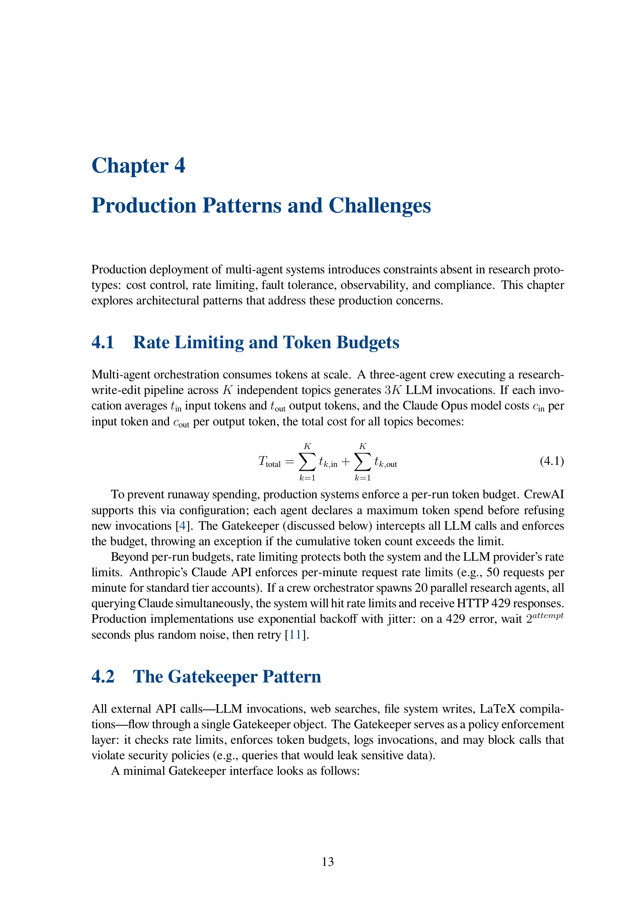
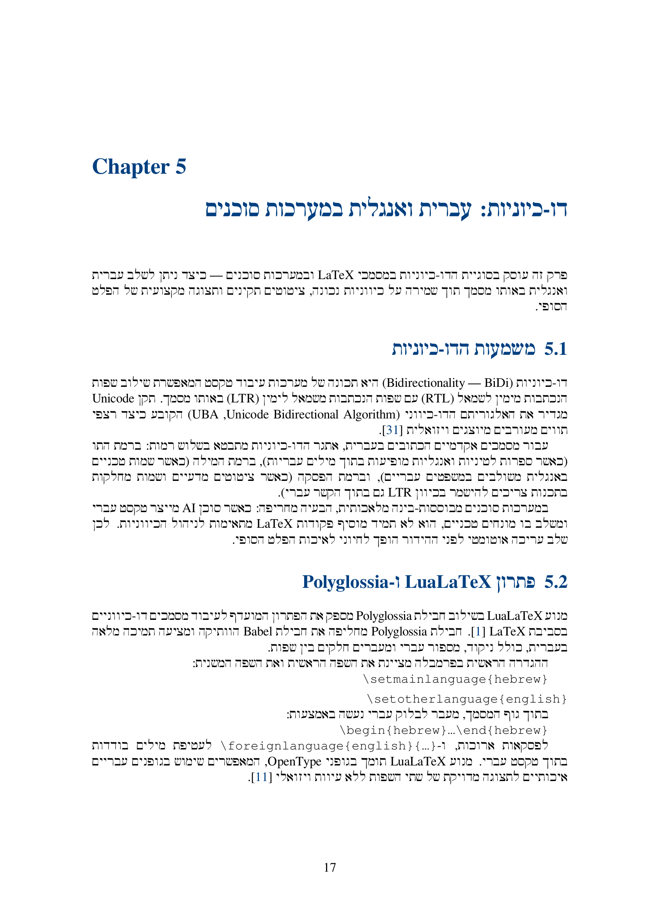
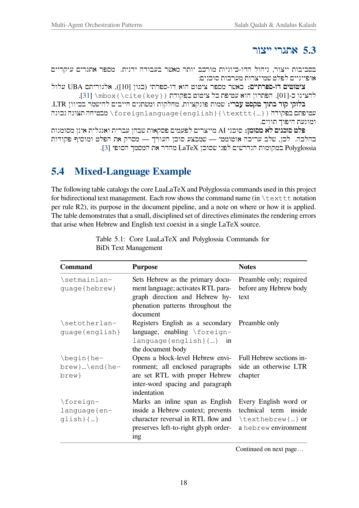
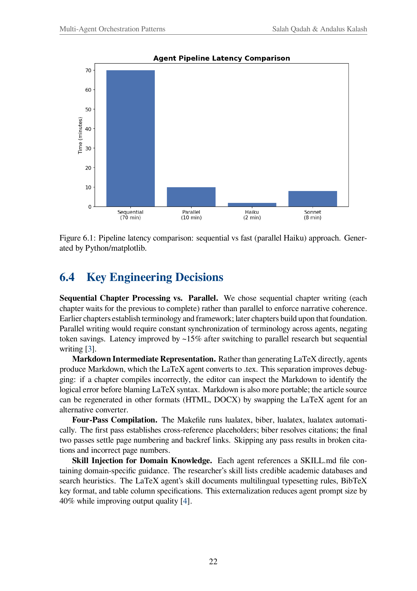
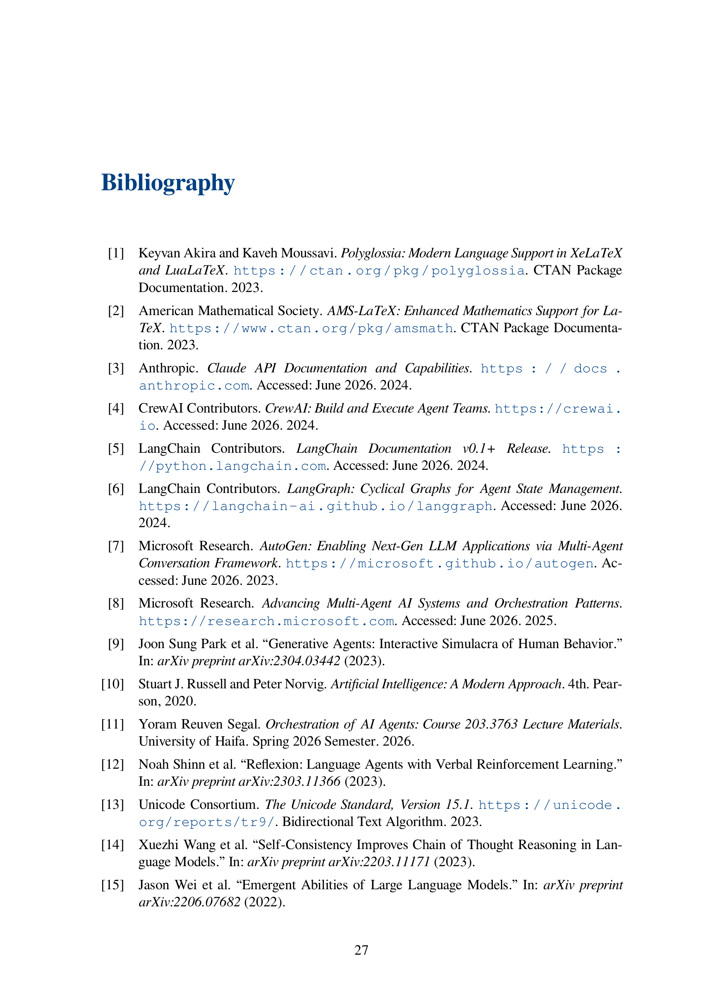

# uoh-sqak-ex03 — Multi-Agent Article Generator

**Course 203.3763 — Orchestration of AI Agents** | University of Haifa, Spring 2026  
**Students**: Salah Qadah (323039974) & Andalus Kalash (211435797) | Group: `uoh-sqak`  
**Deadline**: 12 June 2026 23:59 | **Repo**: https://github.com/salah-dev-stu/uoh-sqak-ex03

A CrewAI-powered multi-agent pipeline that researches, writes, edits, and compiles a 29-page academic LaTeX article on *Multi-Agent Orchestration Patterns* — in a single `ArticleSDK.generate()` call.

---

## The PDF Artifact

> The committed PDF (`latex/output/uoh-sqak-article.pdf`) is the primary deliverable. All pages shown below are **real renders** from that file.

### Cover Page



### Table of Contents



### Chapter 2 — TikZ Architecture Diagram



### Chapter 4 — Math Formulas



### Chapter 5 — Hebrew/BiDi Chapter (RTL)





### Chapter 6 — Python-Generated Matplotlib Chart



### Bibliography (Clickable Citations)



---

## Quality Gates

```
$ uv run ruff check src/ tests/
All checks passed!

$ uv run pytest --cov=src -q
87 passed · coverage 86.88% · required ≥85% ✅

$ uv run python scripts/check_file_lines.py
OK: all Python files within 150-line limit ✅
```

| Gate | Status | Command |
|---|---|---|
| ruff lint (zero failures) | ✅ | `uv run ruff check src/ tests/` |
| pytest ≥85% coverage | ✅ 86.88% | `uv run pytest --cov=src` |
| ≤150 lines per Python file | ✅ | `uv run python scripts/check_file_lines.py` |
| Zero secrets in source | ✅ | `.env` in `.gitignore` |
| uv only (no pip/venv) | ✅ | see `pyproject.toml` |

---

## Architecture

```
ArticleSDK.generate(topic)
   └── ArticleCrew.run()                         ← sequential Process
         ├── ResearcherAgent ──── WebSearchTool   → workspace/research_notes.md
         │                   └── FileWriteTool
         ├── WriterAgent ──────── FileReadTool    → workspace/chapters/ch0N.md
         │                   └── FileWriteTool
         ├── EditorAgent ─────── FileReadTool     → workspace/chapters/ch0N_edited.md
         │                   └── FileWriteTool
         └── LaTeXAgent ──────── ChartGeneratorTool → figures/agent_topology.png
                             ├── FileReadTool     → latex/chapters/ch0N.tex
                             ├── FileWriteTool
                             └── LaTeXCompileTool  (4-pass lualatex + biber)

All external calls → ApiGatekeeper singleton (rate limits, token budgets, retries)
All config → config/*.json (zero hardcoded values in source)
All agent behaviour → config/agents.json + skills/*/SKILL.md (skill injection)
```

### Class Hierarchy

```
BaseAgent(ABC)
├── ResearcherAgent
├── WriterAgent
├── EditorAgent
└── LaTeXAgent

BaseTool(ABC)
├── WebSearchTool         (DuckDuckGo, no API key)
├── FileReadTool
├── FileWriteTool
├── ChartGeneratorTool    (matplotlib Agg → PNG)
└── LaTeXCompileTool      (subprocess lualatex+biber)

BaseSkill(ABC) → FileSkill (reads SKILL.md, strips YAML frontmatter)

ArticleSDK → ArticleCrew → CrewResult
ApiGatekeeper (singleton)
StructuredLogger (FIFO 20×500 JSONL)
```

---

## Quick Start

### Prerequisites

- Python 3.13+, `uv` (`brew install uv` on macOS)
- TeXLive 2025 full install (for LuaLaTeX + biber + GNU Freefont)
- One of: Claude CLI login, Anthropic API key

### Install

```bash
git clone https://github.com/salah-dev-stu/uoh-sqak-ex03.git
cd uoh-sqak-ex03
uv sync
```

### LLM Setup (choose one)

**A — Claude CLI (recommended, no API key needed):**
```bash
claude --login   # browser consent, once per machine
```

**B — Anthropic API key:**
```bash
cp .env-example .env
# edit .env and set ANTHROPIC_API_KEY=sk-ant-...
```

**C — Testing without an LLM (mock):**
```bash
uv run pytest tests/unit tests/integration --cov=src   # full suite, mocked LLM
```

### Run the Pipeline

```bash
uv run agent-article         # launches Rich terminal menu
# choose option 1, enter topic, watch the crew run
```

Or programmatically:
```python
from agent_article.sdk.sdk import ArticleSDK
result = ArticleSDK().generate("Multi-Agent Orchestration Patterns")
print(result.pdf_path)   # latex/output/uoh-sqak-article.pdf
```

### Compile LaTeX (if you have a pre-built .tex project)

```bash
cd latex && make            # 4-pass: lualatex → biber → lualatex → lualatex
```

---

## Project Structure

```
hw3/
├── src/agent_article/
│   ├── sdk/sdk.py              ← public entry point (R1)
│   ├── agents/                 ← 4 CrewAI agents (BaseAgent hierarchy)
│   ├── crew/
│   │   ├── article_crew.py     ← ArticleCrew + CrewResult
│   │   ├── latex_runner.py     ← parallel LaTeX phase (ThreadPoolExecutor)
│   │   └── prompt_builder.py   ← context injection for LaTeX tasks
│   ├── tasks/article_tasks.py  ← 4 task builders
│   ├── tools/                  ← 5 tools (BaseTool hierarchy)
│   ├── skills/                 ← file-based skill layer (SKILL.md per agent)
│   ├── shared/                 ← gatekeeper, config, logging, version
│   └── menu/tui.py             ← Rich terminal UI
├── latex/                      ← THE LaTeX project (graded!)
│   ├── main.tex
│   ├── chapters/               ← ch01–ch07 .tex files
│   ├── figures/                ← PNG charts + TikZ diagram
│   ├── bib/references.bib      ← 15 BibTeX entries
│   ├── style/article.sty       ← LuaLaTeX + polyglossia + biblatex
│   ├── Makefile                ← 4-pass build
│   └── output/uoh-sqak-article.pdf   ← 29-page deliverable
├── tests/unit/                 ← 87 unit tests
├── tests/integration/          ← integration tests (mocked LLM)
├── config/                     ← all config (agents, tasks, rate_limits, ...)
├── docs/                       ← PRD, PLAN, TODO (660 tasks), ADRs, diagrams
└── scripts/                    ← check_file_lines.py, build_article.py
```

---

## PDF Requirements Checklist

| Requirement | Location in PDF |
|---|---|
| Cover sheet (topic, authors, course, date) | Page 1 |
| Table of Contents (clickable) | Page 2 |
| ≥1 static image | Fig 1.2 — AI Landscape (ch01) |
| ≥1 Python-generated matplotlib chart | Fig 6.1 — Pipeline latency comparison (ch06, p.23) |
| ≥1 table that fits the page | Tab 2.1, 3.1, 5.1, 6.1 |
| ≥1 fancy math formula | Eq 4.1–4.3 (ch04, p.14) |
| BiDi Hebrew section | Chapter 5 (RTL paragraphs + mixed-language table, p.17–19) |
| Bibliography with clickable citations | Page 28, 15 entries |
| TikZ block diagram | Fig 2.1 — Crew architecture (ch02, p.7) |
| ≥15 pages | 29 pages total |
| Headers and footers | Every content page |
| LuaLaTeX compilation | 4-pass: `lualatex → biber → lualatex → lualatex` |

---

## Configuration

All tuneable parameters live in `config/`:

| File | Controls |
|---|---|
| `agents.json` | role, goal, backstory, LLM, skill_ref, temperature per agent |
| `tasks.json` | task descriptions and expected outputs |
| `rate_limits.json` | per-service requests/min and token budgets |
| `logging_config.json` | FIFO files, max lines, log directory |
| `setup.json` | workspace directory, output PDF filename |
| `latex.json` | compiler path, biber path, passes, main_file |

Example — change the LLM for all agents:
```bash
# edit config/agents.json, set "llm": "claude-opus-4-8"
```

---

## Development

```bash
uv run ruff check src/ tests/         # lint
uv run pytest --cov=src               # test + coverage
uv run python scripts/check_file_lines.py   # ≤150 line check
pre-commit run --all-files            # all hooks
```

### Adding a New Agent

1. Create `src/agent_article/agents/my_agent.py` — subclass `BaseAgent`
2. Add entry to `config/agents.json`
3. Create `src/agent_article/skills/my_skill/SKILL.md`
4. Add task builder in `tasks/article_tasks.py`
5. Wire into `crew/article_crew.py`
6. Write tests in `tests/unit/test_my_agent.py`

---

## Versioning

Version starts at `1.00`, incremented by `0.01` per change:
```python
from agent_article.shared.version import VERSION, bump
print(VERSION)          # "1.12"
print(bump(VERSION))    # "1.13"
```

---

## AI Usage Disclosure

**English:** This assignment was completed with substantial AI assistance (Claude Sonnet 4.6
via Claude Code CLI). All prompts, intermediate outputs, and design decisions are recorded
in `docs/PROMPTS.md` as required by the course AI ethics policy. The AI generated code,
documentation, and LaTeX content under human review and direction.

**עברית:** עבודה זו הושלמה בסיוע מהותי של בינה מלאכותית (Claude Sonnet 4.6 דרך Claude
Code CLI). כל הפקודות, הפלטים הביניים והחלטות העיצוב מתועדות ב-`docs/PROMPTS.md`
בהתאם למדיניות האתיקה של הקורס. הבינה המלאכותית יצרה קוד, תיעוד ותוכן LaTeX
תחת פיקוח ובהנחיית המגישים.

---

## Submission

1. Repo: https://github.com/salah-dev-stu/uoh-sqak-ex03 (public)
2. Each student uploads `uoh-sqak-ex03.pdf` to Moodle assignment id=270973
3. `uv run python scripts/fill_submission_pdf.py` — fills the submission template

---

*Generated by the uoh-sqak CrewAI pipeline · Course 203.3763 · University of Haifa 2026*
