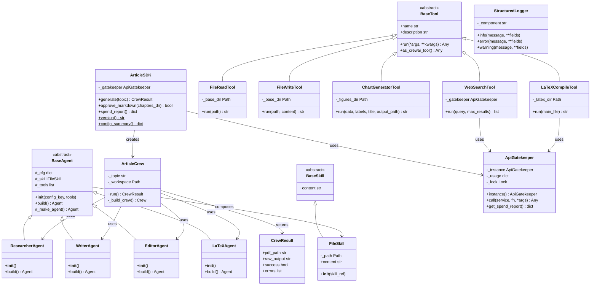

# Class Diagram — agent_article

```mermaid
classDiagram

%% ── Agent hierarchy ──────────────────────────────────────
class BaseAgent {
    <<abstract>>
    #_cfg dict
    #_skill FileSkill
    #_tools list
    +__init__(config_key, tools)
    +build() Agent
    #_make_agent() Agent
}

class ResearcherAgent {
    +__init__()
    +build() Agent
}

class WriterAgent {
    +__init__()
    +build() Agent
}

class EditorAgent {
    +__init__()
    +build() Agent
}

class LaTeXAgent {
    +__init__()
    +build() Agent
}

BaseAgent <|-- ResearcherAgent
BaseAgent <|-- WriterAgent
BaseAgent <|-- EditorAgent
BaseAgent <|-- LaTeXAgent

%% ── Tool hierarchy ───────────────────────────────────────
class BaseTool {
    <<abstract>>
    +name str
    +description str
    +run(*args, **kwargs) Any
    +as_crewai_tool() Any
}

class WebSearchTool {
    -_gatekeeper ApiGatekeeper
    +run(query, max_results) list
}

class FileReadTool {
    -_base_dir Path
    +run(path) str
}

class FileWriteTool {
    -_base_dir Path
    +run(path, content) str
}

class ChartGeneratorTool {
    -_figures_dir Path
    +run(data, labels, title, output_path) str
}

class LaTeXCompileTool {
    -_latex_dir Path
    +run(main_file) str
}

BaseTool <|-- WebSearchTool
BaseTool <|-- FileReadTool
BaseTool <|-- FileWriteTool
BaseTool <|-- ChartGeneratorTool
BaseTool <|-- LaTeXCompileTool

%% ── Skill hierarchy ──────────────────────────────────────
class BaseSkill {
    <<abstract>>
    +content str
}

class FileSkill {
    -_path Path
    +__init__(skill_ref)
    +content str
}

BaseSkill <|-- FileSkill

%% ── Crew / SDK ───────────────────────────────────────────
class ArticleSDK {
    -_gatekeeper ApiGatekeeper
    +generate(topic) CrewResult
    +approve_markdown(chapters_dir) bool
    +spend_report() dict
    +version() str$
    +config_summary() dict$
}

class ArticleCrew {
    -_topic str
    -_workspace Path
    +run() CrewResult
    -_build_crew() Crew
}

class CrewResult {
    +pdf_path str
    +raw_output str
    +success bool
    +errors list
}

ArticleSDK --> ArticleCrew : creates
ArticleCrew --> ResearcherAgent : uses
ArticleCrew --> WriterAgent : uses
ArticleCrew --> EditorAgent : uses
ArticleCrew --> LaTeXAgent : uses
ArticleCrew --> CrewResult : returns

%% ── Shared ───────────────────────────────────────────────
class ApiGatekeeper {
    -_instance ApiGatekeeper
    -_usage dict
    -_lock Lock
    +instance()$ ApiGatekeeper
    +call(service, fn, *args) Any
    +get_spend_report() dict
}

class StructuredLogger {
    -_component str
    +info(message, **fields)
    +error(message, **fields)
    +warning(message, **fields)
}

ArticleSDK --> ApiGatekeeper : uses
WebSearchTool --> ApiGatekeeper : uses
LaTeXCompileTool --> ApiGatekeeper : uses
BaseAgent --> FileSkill : composes
```
